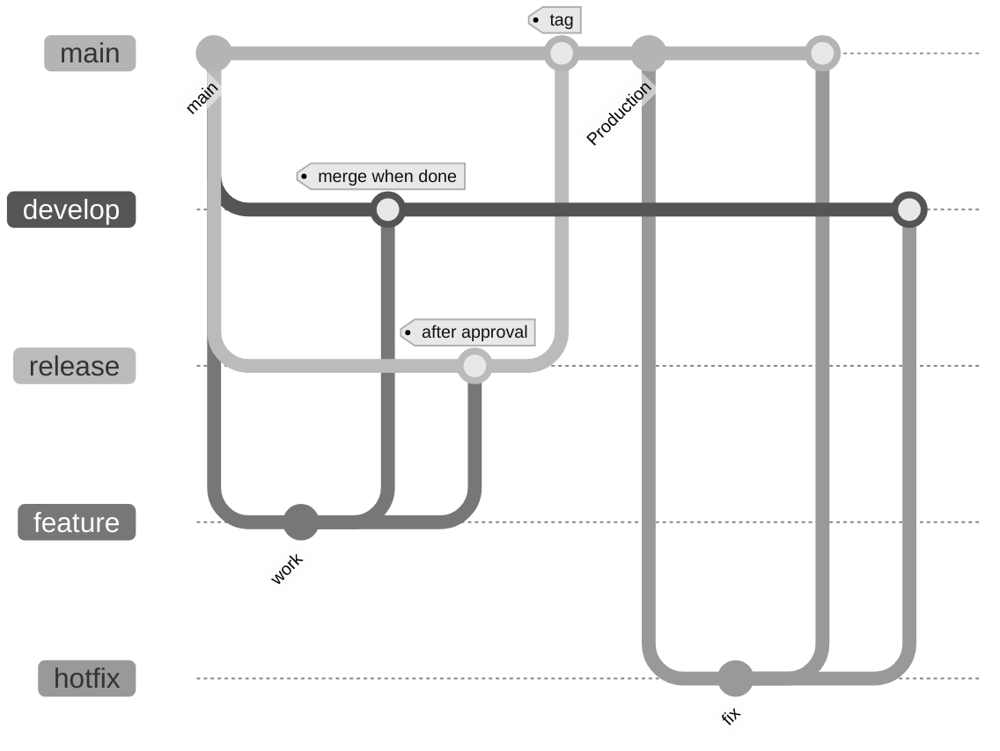

# DDEV Shopware 6.7 Base

Base setup for Shopware 6.7 with DDEV. Use as a template for different projects.

## Requirements

- [Docker](https://docs.docker.com/get-docker/)
- [DDEV](https://ddev.readthedocs.io/en/latest/#installation)

## Setup

1. **Start project:** Run `make ddev-setup`. Ensure `install.lock` exists in the project root (created by setup or after a manual install).
2. **Database (optional):** Import a dump (see [Database](#database)), then set sales channel domains to `https://<project>.ddev.site` and `http://<project>.ddev.site`.

### DDEV commands

| Action                      | Command                 |
| --------------------------- | ----------------------- |
| Start project               | `ddev start`            |
| Ports & status              | `ddev describe`         |
| Shell                       | `ddev ssh`              |
| Storefront watch            | `make ddev-storefront`  |
| Admin watch                 | `make ddev-admin`       |
| Build (Storefront + Admin)  | `make ddev-build`       |

### Image proxy (optional)

To load assets from an external source (e.g. S3), run `make ddev-image-proxy` in a separate terminal alongside your running DDEV project. Do not commit `config/packages/zzz-sw-cli-image-proxy.yml`; it may affect production.

### Database

Dumps can be stored in `./.devOps/db/*.sql.gz`. The import command expects `./db.sql` by default; override with `database=<path>`, e.g.:

```bash
make ddev-import-db database=./.devOps/db/your-dump.sql.gz
```

If you do not import a dump, `install.lock` must exist so the Shopware installation assistant does not run.

### Cursor (IDE rules & MCP)

The project includes **Cursor rules** (`.cursor/rules/*.mdc`) for consistent AI assistance (Shopware 6.7, theme/storefront, PHP plugins, DDEV). MCP is configured with **Context7** for up-to-date Shopware documentation.

- Add your **Context7 API key** to `.env.local`: `CONTEXT7_API_KEY=your_key` (get a free key at [context7.com/dashboard](https://context7.com/dashboard)). Do not commit the key.
- Verify: `make check-context7` (should print "OK: CONTEXT7_API_KEY is set").
- Details on rules, MCP, and scripts: [.cursor/README.md](.cursor/README.md).

1. Run `make ddev-setup`. Ensure `install.lock` exists in the project root (created by setup or after a manual install).
2. If you have a database dump: import it (see Database), then set sales channel domains to `https://schwalbe-shop-sde.ddev.site` and `http://schwalbe-shop-sde.ddev.site`.

### DDEV commands

| Action                      | Command                 |
| --------------------------- | ----------------------- |
| Start project               | `ddev start`            |
| Ports and status            | `ddev describe`         |
| Shell                       | `ddev ssh`              |
| Storefront watch            | `make ddev-storefront`  |
| Admin watch                 | `make ddev-admin`       |
| Build (storefront + admin)  | `make ddev-build`       |

#### Local Developer Documentation

The local developer documentation is available on `http://schwalbe-shop-sde.ddev.site:9004` and can be edited inside the `./docs` folder.
(See [DDEV MkDocs](https://github.com/Metadrop/ddev-mkdocs?tab=readme-ov-file))

#### Image proxy

To load assets from the S3 bucket, run `make ddev-image-proxy` in a separate terminal alongside your running DDEV project. Do not commit `config/packages/zzz-sw-cli-image-proxy.yml`; it would affect production.

### Database

Dumps are stored in `./.devOps/db/*.sql.gz`. The import command expects `./db.sql` by default; use `database=<path>` to override (e.g. `make ddev-import-db database=./.devOps/db/your-dump.sql.gz`). If you do not import a dump, `install.lock` must exist so the Shopware installation assistant does not run.

```bash
make ddev-import-db
```

## Deployment & workflow



- **develop/staging** and **release** branch from **main**.
- **feature** branches from **main**; merge into **develop/staging** when done.
- After approval, merge **feature** into **release**.
- When **release** is ready, merge into **main** and create a **tag**.
- **Hotfixes** branch from **main** and merge into **develop** and **main**.

Close or delete feature branches only after they have been deployed to production.

