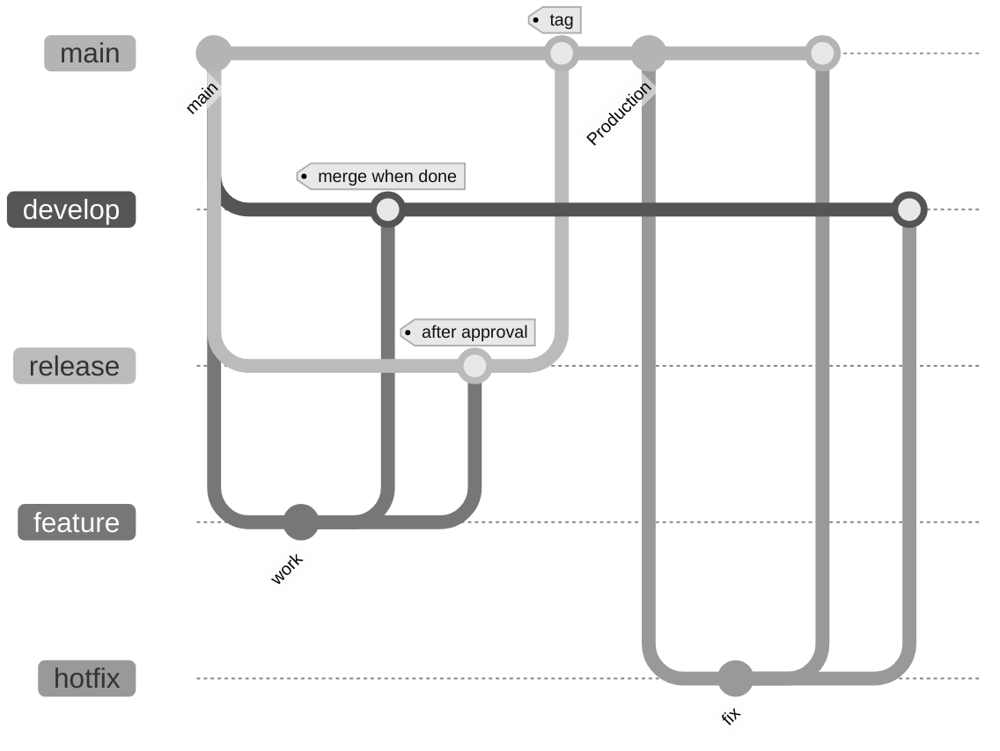

# Deployment & workflow

## Git-flow

## Deployment strategy

- **develop/staging** and **release** branch from **main**.
- **feature** branches from **main**; merge into **develop/staging** when done.
- After approval, merge **feature** into **release**.
- When **release** is ready, merge into **main** and create a **tag**.
- **Hotfixes** branch from **main** and merge into **develop** and **main**.

Close or delete feature branches only after they have been deployed to production.